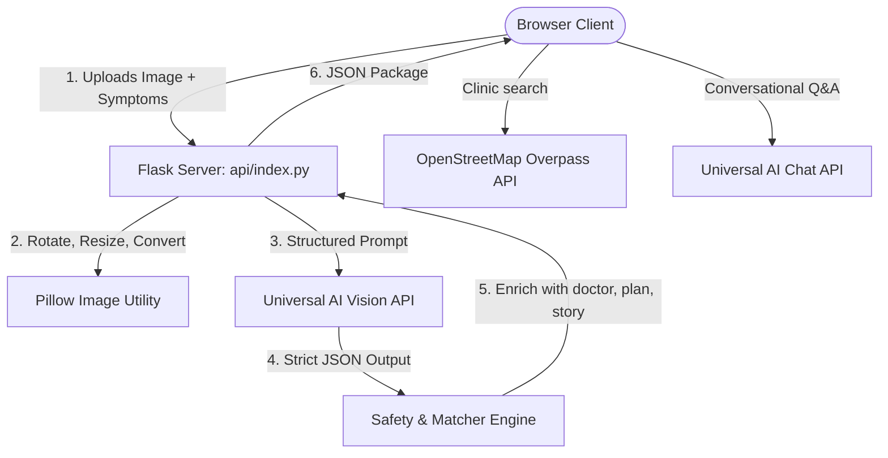

# ReportSaathi - AI Medical Report Explainer For Everyone

> **"Medical reports shouldn't require a medical degree to understand."**

ReportSaathi is a production-grade, highly accessible web application designed to translate complex laboratory screening reports (like CBC, Urine Routine, and Liver/Thyroid markers) into plain, jargon-free language. 

Built especially for the elderly, parents, and people uncomfortable with medical terminology, ReportSaathi features a striking **Neo-Brutalist design language**, browser-native speech synthesis (supporting **English, Hindi, and Marathi**), conversational chat Q&A, localized maps/clinic lookup, and a printable Doctor Visit Summary.

---

## 🏗️ Architecture

The application is structured for fast local development and instant deployment as serverless functions on Vercel:



---

## 🛠️ Tech Stack

- **Backend**: Python, Flask, Pillow (Image Preprocessing)
- **AI Engine**: Universal AI Vision (routed to Gemini/Nvidia/Groq)
- **Frontend**: HTML5, Vanilla CSS3 (Neo-Brutalist Layout), Vanilla JS (Modular Architecture)
- **PWA Capabilities**: Service worker caching and installation manifest
- **Local Maps Directory**: OpenStreetMap Overpass Interpreter & Nominatim reverse-geocoder

---

## 📂 Project Structure

```
.
├── api/
│   └── index.py            # Main Flask Server & Routing Entrypoint
├── app/
│   ├── services/
│   │   ├── doctor_finder.py      # Geocoding & OpenStreetMap Overpass search
│   │   ├── ai_service.py         # AI Vision & chat completion integrations
│   │   └── safety_engine.py      # Clinical doctor matching, plans, parent translation
│   ├── static/
│   │   ├── css/
│   │   │   └── main.css          # Neo-Brutalist style directives (accessible fonts)
│   │   ├── js/
│   │   │   ├── api.js            # Fetch calls to backend endpoints
│   │   │   ├── app.js            # Core page transitions and uploader states
│   │   │   ├── location.js       # Geolocation permissions and manual search
│   │   │   ├── theme.js          # Font scale sliders and reduced motion pref
│   │   │   └── voice.js          # Speech synthesis (HI, MR, EN) & recognition Q&A
│   │   ├── icons/
│   │   │   ├── icon-192.png      # Generated PWA launcher icons
│   │   │   └── icon-512.png
│   │   ├── manifest.json         # PWA installation manifest
│   │   └── sw.js                 # PWA Service Worker caching
│   ├── templates/
│   │   └── index.html            # Core frontend markup (fully responsive)
│   └── utils/
│       ├── image_utils.py        # Orientation transpose and image resizer
│       └── sample_report.py      # Mock CBC & Urine analysis fixtures
├── tests/
│   └── test_app.py         # 12-test unit suite (mock assertions)
├── requirements.txt        # Python package specifications
├── vercel.json             # Vercel Serverless Routing configurations
└── README.md               # Documentation
```

---

## 🔒 Safety & Medical Disclaimer Design

ReportSaathi implements strict clinical guardrails:
1. **No Certainty / Diagnosis**: The AI never claims "You have X disease." It uses words like *"This result is within range"* or *"This pattern can sometimes be associated with... please check with a doctor."*
2. **Emergency Escalar**: If critical markers (e.g. Hemoglobin < 7, severe bleeding) are detected alongside symptoms, a prominent **RED emergency panel** overrides the dashboard telling the user to go to the nearest emergency department.
3. **Doctor visit companion**: It compiles patient notes, questions, and flagged tests into a printable summary sheet. It does not fabricate doctor prescriptions.
4. **Data Privacy**: Medical report images are processed server-side in-memory and are **never** logged or stored permanently. Medical reports are completely separated from geolocation map requests.

---

## ⚙️ Environment Setup & Variables

Copy `.env.example` to `.env` and configure:

```bash
cp .env.example .env
```

Variables:
- `GEMINI_API_KEY` / `NVIDIA_API_KEY` / `GROQ_API_KEY`: Set your key in env.
- Models are mapped dynamically depending on which key format is loaded.
- `GOOGLE_MAPS_API_KEY` / `MAPPLS_API_KEY`: (Optional) Fallbacks are set to OpenStreetMap, which requires no keys.

### 🧪 Demo / Simulator Mode
If no API Key is present, **ReportSaathi automatically activates Simulator/Demo Mode**. All features remain fully testable. Selecting "Try a Sample Report" loads mock lab values that proceed through the exact same parsing, translation, geolocation lookup, print summaries, and voice narratives.

---

## 🚀 Local Installation & Execution

1. **Clone the project** and navigate into the folder.
2. **Create a virtual environment** to isolate dependencies:
   ```bash
   python3 -m venv venv
   source venv/bin/activate
   ```
3. **Install dependencies**:
   ```bash
   pip install -r requirements.txt
   ```
4. **Run the local server**:
   ```bash
   python api/index.py
   ```
5. Open your browser to `http://localhost:5000`.

### 🧪 Running Unit Tests
To verify all handlers:
```bash
python -m unittest tests/test_app.py
```

---

## 🌐 Vercel Serverless Deployment

This project is fully ready for deployment on **Vercel** utilizing Python Serverless Runtimes:
1. Install vercel CLI: `npm install -g vercel`
2. Run `vercel` from the root directory.
3. Add your active AI key environment variable in your Vercel Project Dashboard.

---

## 📖 API Endpoint Documentation

### 1. `POST /api/analyze-report`
Analyzes report images. Returns structured parameters, classifications, and simplified translations.
- **Payload**: Multipart/form-data containing `images[]`, `language`, `symptoms[]`, `age`, `sex`, and `demo`.
- **Response**: JSON structure containing patient meta, list of tests, doctor type suggestions, action plans, visual story, and parent simplified version.

### 2. `POST /api/ask-report`
Handles Q&A dialog matching context bounds.
- **Payload**: JSON containing `report_data`, `question`, `history[]`, and `language`.

### 3. `GET /api/nearby-doctors`
Queries OSM Overpass to find nearby clinics/hospitals.
- **Parameters**: `lat`, `lon` or `city` name.

### 4. `POST /api/compare-reports`
Evaluates numerical shifts between matching tests over time.
- **Payload**: JSON containing `current` report data and `previous` report data.
